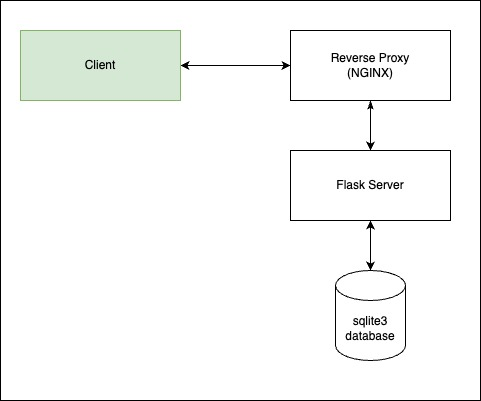

## This is the code for the take home assignment of Lead Python Dev Role

## High Level Diagram
Built using Flask, with sqlite3 as database. The whole app is in a Docker container, with nginx as reverse proxy. Unit tests are written using pytest.

## Getting started

1. Make sure you have docker installed on your machine. Instructions can be found [here](https://docs.docker.com/get-docker/)
2. Clone this repository.
3. Setup a `.env` file with `SQLALCHEMY_DATABASE_URI` and `JWT_SECRET_KEY` secrets.
4. Run the whole app using `docker-compose build` and `docker-compose up`.
5. Use the postman collection present in `docs` folder to test.
6. Unit tests can be run with `pytest`.
